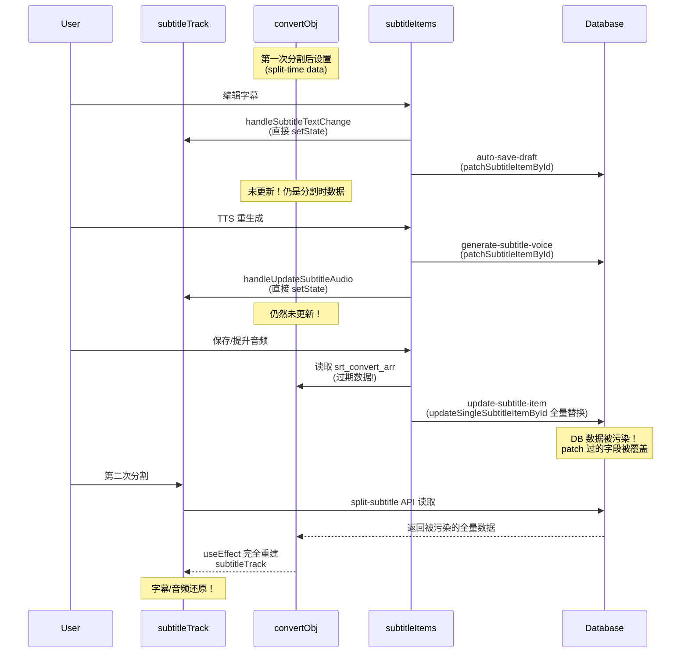

# 分割后音频/字幕还原 Bug 分析

## 根本原因：`handleSave` 使用过期的 `convertObj` 做全量覆盖写入

整个数据流涉及三个关键状态源和两种 DB 写入方式，彼此之间存在不一致。

---

## 涉及的关键文件

- `[page.tsx](<src/app/[locale]/(dashboard)`/video_convert/video-editor/[id]/page.tsx>) — 主编辑页面，管理 `convertObj` 和 `subtitleTrack`
- `[subtitle-workstation.tsx](<src/app/[locale]/(dashboard)`/video_convert/video-editor/[id]/subtitle-workstation.tsx>) — 左侧面板，管理 `subtitleItems`，包含 `handleSave`
- `[update-subtitle-item/route.ts](src/app/api/video-task/update-subtitle-item/route.ts)` — 保存/提升音频的 API
- `[vt_task_subtitle.ts](src/shared/models/vt_task_subtitle.ts)` — 包含 `updateSingleSubtitleItemById`（全量替换）和 `patchSubtitleItemById`（局部补丁）

---

## Bug 触发链条（分步追踪）

### 1. `convertObj` 不随编辑操作更新

当用户编辑字幕文本或重新生成音频时：

- `handleSubtitleTextChange`（page.tsx:3068）只更新 `subtitleTrack`（直接 `setSubtitleTrack`）
- `handleUpdateSubtitleAudio`（page.tsx:3064）只更新 `subtitleTrack`（直接 `setSubtitleTrack`）
- **两者都不更新 `convertObj.srt_convert_arr`**

TTS API 和 auto-save-draft API 通过 `patchSubtitleItemById` 正确地**局部更新**了 DB：

- `vap_draft_txt`、`vap_draft_audio_path`、`vap_tts_updated_at_ms` 等字段被正确 patch 到 DB

但 `convertObj` 在 React 状态中仍然是上次 `setConvertObj` 时的快照。

### 2. `handleSave` 从过期的 `convertObj` 构造完整对象

`[subtitle-workstation.tsx](<src/app/[locale]/(dashboard)`/video_convert/video-editor/[id]/subtitle-workstation.tsx>) 第 704-798 行：

```typescript
const handleSave = async (item: SubtitleRowData, type: string) => {
  const convertArr = (convertObj.srt_convert_arr || []) as any[];
  const targetItem = convertArr.find((itm: any) => itm?.id === item.id);
  // targetItem 来自过期的 convertObj！
  const nextItem = { ...targetItem, txt: item.text_convert };
  // nextItem 包含过期的 vap_draft_txt, vap_draft_audio_path, vap_tts_updated_at_ms 等
  await fetch('/api/video-task/update-subtitle-item', {
    body: JSON.stringify({ ..., item: nextItem }),
  });
};
```

### 3. API 做全量替换，覆盖了正确的 patch 数据

`[update-subtitle-item/route.ts](src/app/api/video-task/update-subtitle-item/route.ts)` 第 65-74 行：

```typescript
const nextItem = {
  ...item, // <-- 来自客户端的过期数据！
  audio_url: `adj_audio_time/${id}.wav`,
  vap_voice_status: 'ready',
  vap_needs_tts: false,
};
await updateSingleSubtitleItemById(taskId, type, id, nextItem);
```

`[vt_task_subtitle.ts](src/shared/models/vt_task_subtitle.ts)` 第 154-177 行 — `updateSingleSubtitleItemById` 使用 SQL 全量替换：

```sql
CASE WHEN elem->>'id' = ${id}
  THEN ${JSON.stringify(updatedItem)}::jsonb  -- 完全替换，不是 merge！
  ELSE elem
END
```

**结果**：之前由 TTS 和 auto-save 正确 patch 到 DB 的字段被覆盖为过期值。

### 4. 第二次分割读取被污染的 DB 数据

`[split-subtitle/route.ts](src/app/api/video-task/split-subtitle/route.ts)` 读取 DB 全量数据，执行分割后返回完整数组。客户端用此数据替换 `convertObj`（page.tsx:2821-2828），触发 `useEffect`（page.tsx:745-843）**完全重建** `subtitleTrack`。

重建时的行为：

```typescript
const draftTxt = (entry as any)?.vap_draft_txt;  // 被 handleSave 覆盖为旧值
return {
  text: draftTxt || entry.txt,  // 使用了过期的 vap_draft_txt → 字幕还原！
  audioUrl: ...,  // 基于被覆盖的字段计算
};
```

---

## 各段还原的具体机制

### 第一次分割的子段：字幕 + 音频都还原

1. 分割时，`makeTranslateChild` 设置 `vap_draft_txt: effectiveConvertText`（分割时的文本）、`vap_draft_audio_path: ''`、`vap_tts_updated_at_ms: undefined`
2. 用户编辑文本 → auto-save patch 了 `vap_draft_txt: '新文本'`
3. 用户 TTS → patch 了 `vap_draft_audio_path`、`vap_draft_txt`、`vap_tts_updated_at_ms`
4. 用户保存（promote）→ `handleSave` 从过期 `convertObj` 读取（还是分割时的数据），**全量替换** DB

- `vap_draft_txt` 被覆盖为分割时的旧文本
- `vap_tts_updated_at_ms` 被覆盖为 undefined（丢失缓存标识）

1. 第二次分割 → 读取被污染的 DB → 重建 UI

- **字幕**：`draftTxt || entry.txt` 取到旧的 `vap_draft_txt` → 还原
- **音频**：URL 正确（`adj_audio_time/{id}.wav`）但 `vap_tts_updated_at_ms` 丢失 → 无 cache buster → 浏览器可能使用缓存的旧音频

### "下一段"（非分割的已修改段）：仅音频还原

1. 原始数据中没有 `vap_draft_txt` 字段
2. `handleSave` 覆盖后，`vap_draft_txt` 依然不存在（`JSON.stringify` 会忽略 `undefined`）
3. 第二次分割重建时：`draftTxt || entry.txt` → 空 `||` `'正确文本'` → **字幕正确**
4. 但 `vap_tts_updated_at_ms` 同样丢失 → 音频 URL 无 cache buster → 浏览器对 `adj_audio_time/{id}.wav` 使用了编辑前的缓存 → **音频还原**

---

## 数据流图



---

## 补充发现 1：WebAudio 语音缓存加剧音频还原

`page.tsx` 第 206 行的 `voiceCacheRef`（`Map<string, AudioBuffer>`）以 **完整 URL**（含 query 参数）为缓存键：

```typescript
// page.tsx:1198-1203
const ensureVoiceBuffer = useCallback(async (url: string, signal: AbortSignal) => {
  const key = (url || '').trim();
  const cached = cacheGetVoice(key);  // 以完整 URL 为 key
  if (cached) return cached;           // 命中则直接返回旧 buffer
  ...
```

**关键**：该缓存在 `subtitleTrack` 变更时**不会被清除**（page.tsx:206 是一个跨 render 持久的 `useRef`）。

对于"下一段"（非分割的已修改段），音频还原的完整链条为：

1. 页面初始加载：如果原始数据没有 `vap_tts_updated_at_ms`，URL 为 `adj_audio_time/{id}.wav`（无 cache buster）→ WebAudio 解码并缓存**原始音频** buffer
2. 用户编辑 + TTS + 保存 → `subtitleTrack` URL 变为 `adj_audio_time/{id}.wav?t={savedAt}`（有 cache buster）→ 新 key，新 buffer
3. handleSave 全量替换 → DB 丢失 `vap_tts_updated_at_ms`
4. 第二次分割重建 → URL 回到 `adj_audio_time/{id}.wav`（无 cache buster）→ **命中步骤 1 的旧缓存** → 播放原始音频

对于第一次分割的子段：子段 ID 是新的（`{prefix}0001_...`），`adj_audio_time/{childId}.wav` 在 promote 之前不存在，理论上不会有旧缓存。但如果在步骤 2 之前用户曾经通过完整 timeline 预览触发过对默认路径（无 cache buster）的预取/加载尝试（即使返回 404），浏览器/CDN 层面也可能缓存了该响应。

---

## 补充发现 2：工作站 `loadSrtFiles` 导致 UI 状态异常

`subtitle-workstation.tsx` 的 `loadSrtFiles`（第 302-422 行）在 `convertObj` 变更时完全重建 `subtitleItems`：

```typescript
// 第 347-367 行
text_convert: convertItem?.txt || '',        // 来自 DB 的 txt 字段
persistedText_convert: convertItem?.txt || '', // 作为"已保存"基准

// 然后用 vap_draft_txt 覆盖 text_convert:
const draftTxt = convertItem?.vap_draft_txt;
if (draftTxt && typeof draftTxt === 'string') {
  nextItem.text_convert = draftTxt;  // 如果 DB 被污染，这里是旧文本
}
```

对于第一次分割的子段（handleSave 污染后）：

- `persistedText_convert` = `txt` = '新文本'（handleSave 正确设置的）
- `text_convert` = `vap_draft_txt` = '分割时的旧文本'（被 handleSave 污染的）
- `text_convert !== persistedText_convert` → `deriveSubtitleVoiceUiState` 返回 `'text_ready'`
- 工作站 UI 显示"需要重新生成配音"，textarea 显示旧文本 → 用户看到**字幕被还原**

---

## 补充发现 3：`split-subtitle` API 的写写冲突风险

`split-subtitle/route.ts` 先读取 DB（第 64-69 行），中间做音频分割处理（可能耗时），然后用 `replaceSubtitleDataAndLogTx` **全量替换整个 JSON 数组**（第 138-169 行）。

如果在读取和写入之间，有其他操作通过 `patchSubtitleItemById` 更新了某个条目（例如 auto-save-draft 或 TTS 完成的回调），那些更新会被**丢失**，因为 split API 写入的是基于读取时快照的数据。

虽然这个时间窗口通常很短（除非音频分割处理慢），但它是一个潜在的数据丢失风险，与主问题（handleSave 污染）独立存在。

---

## 修复方案

### 方案 A（推荐）：将 `update-subtitle-item` API 改为局部 patch

将 `updateSingleSubtitleItemById`（全量替换）改为 `patchSubtitleItemById`（局部更新），只更新 `handleSave` 需要改变的字段：

- `txt`
- `audio_url` → `adj_audio_time/{id}.wav`
- `vap_voice_status` → `'ready'`
- `vap_needs_tts` → `false`
- `audio_rev_ms` → `Date.now()`
- `vap_draft_audio_path` → `null`（草稿已提升，清除）
- `vap_draft_txt` → `null`（文本已正式保存到 `txt`，清除草稿）

这样不会覆盖 TTS 设置的 `vap_tts_updated_at_ms` 等其他字段。

### 方案 B（补充）：保持 `convertObj` 与编辑操作同步

在 `handleSubtitleTextChange` 和 `handleUpdateSubtitleAudio` 中同时更新 `convertObj.srt_convert_arr` 对应条目的 `vap_draft_txt`/`vap_draft_audio_path` 等字段，确保 `convertObj` 不会过期。

### 方案 C（防御性）：`handleSave` 先从 DB 读取最新数据

在 `handleSave` 中，不从 `convertObj` 读取 `targetItem`，而是调用一个新的 API 端点获取该条目的最新 DB 数据后再写入。

### 方案 D（防御性）：分割后清除 WebAudio 语音缓存

在 `handleSubtitleSplit` 成功后（page.tsx:2821-2828 的 `setConvertObj` 之前），清除 `voiceCacheRef.current`，避免旧 URL 的音频 buffer 被错误复用。

### 推荐实施顺序

1. **方案 A**（最关键）：将 handleSave 的 DB 写入改为局部 patch，彻底消除全量替换导致的数据污染
2. **方案 B**（补充）：保持 `convertObj` 与编辑同步，减少其他地方使用 stale `convertObj` 的风险
3. **方案 D**（防御性）：清除 WebAudio 缓存，避免 URL 变化时播放旧音频
4. 方案 C 一般不需要，方案 A+B 已足够
