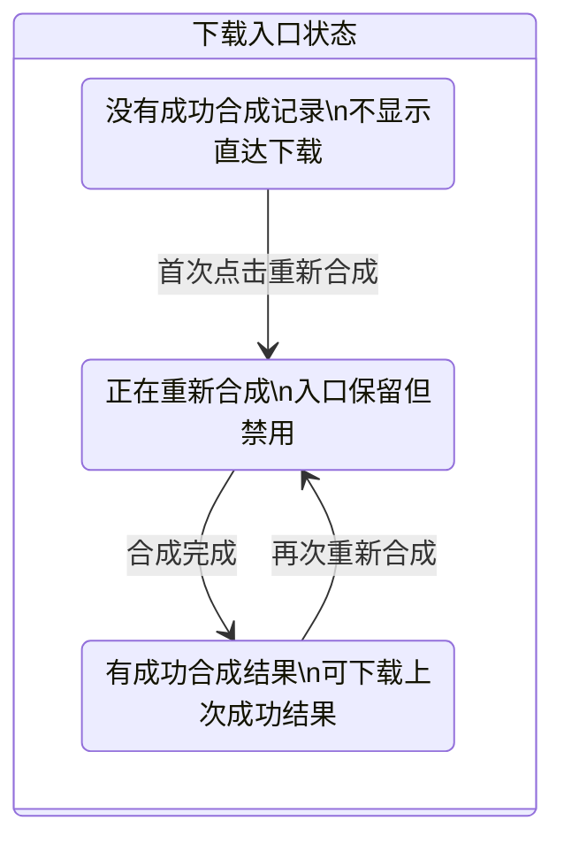

# 合成后下载入口 — 成片直达 + 更多下载方案

## 设计原则：高频直达，低频收口

从用户视角看，编辑页头部的最高频下载动作不是“任意资产”，而是
**下载最终成片**。因此首屏只给一个明确、可识别的直达入口，其它较低频、
需要用户做格式判断的动作统一收进菜单，减少头部思考成本。

### 布局示意

#### 桌面端

```text
[重新合成视频]  [下载成片]  [更多下载 ▾]

更多下载
┌──────────────────────┐
│ 配音音频 .wav         │
│ 背景音频 .wav         │
│ 原字幕 .srt           │
│ 翻译字幕 .srt         │
│ 双语字幕 .srt         │
└──────────────────────┘
```

#### 移动端

```text
[重新合成视频]  [下载 ▾]

下载
┌──────────────────────┐
│ 下载成片             │
│ 配音音频 .wav         │
│ 背景音频 .wav         │
│ 原字幕 .srt           │
│ 翻译字幕 .srt         │
│ 双语字幕 .srt         │
└──────────────────────┘
```

### 交互层级

- 下载成片：1 次点击
- 其它音频 / 字幕：1 次点击打开菜单 + 1 次点击选择
- 所有端统一使用 click，不依赖 hover

### 为什么不用 3 个 icon 平铺

- **识别成本高**：用户需要先猜图标含义，尤其“音频”与“字幕”不是最高频动作
- **信息密度过高**：当前右侧已有积分说明和重新合成，继续平铺 3 个 icon 会让头部过满
- **移动端不稳**：字幕 hover 浮层在触屏端没有一致心智
- **语义不完整**：现有实现里音频实际分成“配音音频 / 背景音频”，不能被一个模糊的音频 icon 覆盖

### 同一行排布（必须考虑）

头部当前结构为 `justify-between`，左侧标题区 `min-w-0` 可压缩，
右侧操作区 `flex shrink-0`。新增下载入口时，优先保证标题可读和按钮语义，
不要为了“全部平铺”牺牲可理解性。

**布局原则**

1. **右侧保持一个操作簇**：将「积分说明 + 重新合成视频 + 下载入口」包在一个 `inline-flex shrink-0 items-center gap-2` 容器内
2. **桌面端最多两个下载入口**：一个直达按钮，一个菜单按钮，不再继续拆成多个独立 icon
3. **移动端固定单菜单**：`max-sm` 下只保留「下载 ▾」，避免头部横向拥挤
4. **禁止头部整体横向滚动**：不使用局部横向滚动兜底，避免工具栏“挤爆”的观感

**验收**

- 常见视口 `1280 / 1024 / 768 / 390` 下标题仍可读
- 右侧操作不换行、不相互遮挡
- 页面不出现横向整页滚动条
- 移动端可以稳定点击打开下载菜单

### UI 设计（视觉与一致性）

保持与现有编辑器头部一致的轻量玻璃感和主次关系，不引入新的视觉体系。

**整体约束**

- 新增下载入口是头部动作簇的一部分，不是一个独立功能岛
- 不新增高饱和背景色、重阴影、夸张描边或新的装饰性底板
- 不做与现有头部不一致的超大圆角、胶囊条、分段控制器式容器
- 优先复用现有 `Button`、`DropdownMenu`、`PopoverContent` 的 token 和 class 习惯
- 视觉目标是“像原生长在这里”，而不是“新加了一块下载模块”

**层级**

- **重新合成视频**：继续做唯一主行动点，沿用当前主按钮样式
- **下载成片**：具名次级按钮，建议优先沿用现有 `size="sm"` 高度与圆角体系，使用 `outline` 或轻量边框样式；它很重要，但不应抢过主流程
- **更多下载**：轻量次级按钮，带 `ChevronDown`，明确告诉用户这里是资产分类入口；高度、内边距、focus ring 与“下载成片”保持一组节奏

**样式细节**

- 与当前右侧 `Info` 按钮和“重新合成视频”按钮在垂直高度上对齐，避免出现 3 套不同高度
- 图标尺寸继续使用当前头部常用的小尺寸 lucide 图标，不混入实心图标体系
- 文案按钮的 hover、active、disabled、focus-visible 都沿用现有 shadcn Button 行为
- 菜单面板复用现有边框透明度、背景色和阴影层级，避免突然出现更厚重的浮层
- 菜单项 hover 高亮保持克制，和当前编辑器头部 Popover/菜单一致，不做高对比块状高亮

**文案策略**

- 不建议桌面端做纯 icon-only 下载按钮
- “下载成片”必须直接写文案，不让用户猜
- “更多下载”必须明确表达“这里包含其它格式”

**状态**

- **默认**：按钮可点，hover 态与现有按钮体系一致
- **合成中**：入口保留但禁用，避免布局跳动
- **结果已存在但不是最新**：允许继续下载上一次成功合成的结果，但要用 tooltip 或辅助文案提示“下载的是上一次成功合成结果”
- **从未合成成功**：隐藏桌面端“下载成片”直达按钮，或在移动端菜单中置灰对应项；不要给用户一个点了才发现没有结果的空动作

**动效**

- 合成完成后可对下载入口做短促 `fade-in` / `slide-in-from-right-2`
- 尊重 `prefers-reduced-motion`
- 菜单开合沿用当前 `DropdownMenu` / `Popover` 的默认节奏，不做额外炫技动效
- 不额外引入“下载区出现时整块发光 / 弹跳 / 强提示”这类会破坏头部平衡的表现

**无障碍**

- 所有入口都要有清晰的 `aria-label`
- 菜单项名称直接写出资源类型和格式
- 键盘可以从主按钮顺序进入下载按钮和菜单项

### 状态逻辑



**关键判断**

- `serverLastMergedAtMs` 仅作为“最近一次成功合成基线”参考
- 下载入口显示 / 禁用应结合：
  - 当前是否存在成功合成结果
  - 当前是否处于 `isTaskRunning` 或 `isMergeJobActive`
  - 是否需要提示“当前下载的是旧版本结果”
- 不建议只用 `serverLastMergedAtMs > 0` 作为唯一显示条件

### 与现有实现的衔接

- 详情页已有视频、音频、字幕下载逻辑，可直接复用下载方式和错误处理
- 详情页当前音频下载分成两类，编辑页不应把它们压扁成一个意义不明的入口
- 详情页字幕使用 click 型菜单，编辑页建议保持同一交互心智

### 关键文件

- `src/app/[locale]/(dashboard)/video_convert/video-editor/[id]/page.tsx`
  - 头部操作区新增“下载成片 / 更多下载”
  - 复用并改造下载状态逻辑
- `src/shared/blocks/video-convert/project-detail-view.tsx`
  - 参考现有 `handleDownloadVideo`、音频下载、字幕下载实现
- `src/config/locale/messages/zh/video_convert/videoEditor.json`
  - 新增中文下载入口文案
- `src/config/locale/messages/en/video_convert/videoEditor.json`
  - 新增英文下载入口文案
- API 路由已就绪：
  - `download-video`
  - `download-audio`
  - `download-one-srt`
  - `download-double-srt`
