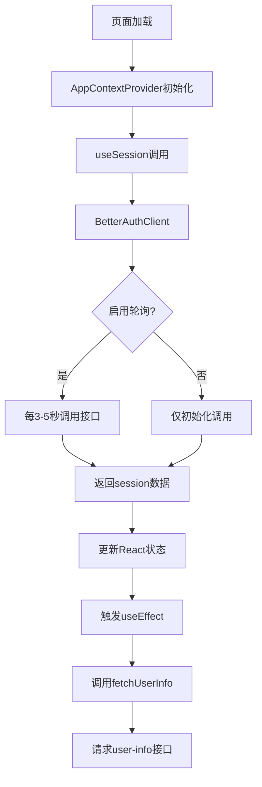
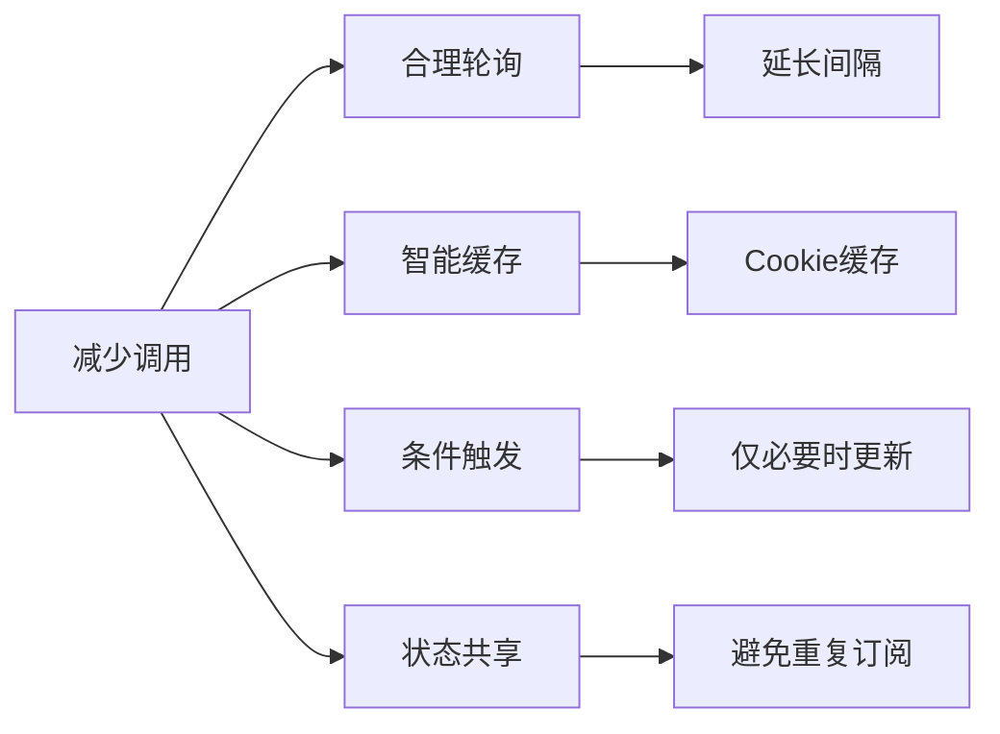

# /api/auth/get-session 接口完整梳理

## 一、接口是什么

`/api/auth/get-session` 是 **Better Auth** 库自动生成的会话获取接口，用于：

1. **验证用户登录状态** - 检查当前用户是否已登录
2. **获取用户信息** - 返回用户基本信息（name, email, image, credits等）
3. **会话有效性检查** - 验证 session token 是否过期

### 接口路由

- 路径：`/api/auth/[...all]/route.ts` - 这是一个 catch-all 路由
- Better Auth 自动处理所有 `/api/auth/*` 请求
- `get-session` 是 Better Auth 内置的端点之一

相关文件：

- [`src/app/api/auth/[...all]/route.ts`](src/app/api/auth/[...all]/route.ts) - API 路由处理器
- [`src/core/auth/index.ts`](src/core/auth/index.ts) - Auth 实例创建
- [`src/core/auth/config.ts`](src/core/auth/config.ts) - Auth 配置

## 二、调用链路分析



### 关键调用点

1. **AppContextProvider** ([`src/shared/contexts/app.tsx`](src/shared/contexts/app.tsx):40)
   ```tsx
   const { data: session, isPending } = useSession();
   ```


   - 在应用根布局中使用，每个页面都会执行
   - `useSession` 来自 Better Auth 的 React Hook

2. **SidebarUser** ([`src/shared/blocks/dashboard/sidebar-user.tsx`](src/shared/blocks/dashboard/sidebar-user.tsx):39)
   ```tsx
   const { data: session, isPending } = useSession();
   ```


   - 侧边栏组件也调用了 `useSession`

3. **SocialCreditsHandler** ([`src/shared/blocks/sign/social-credits-handler.tsx`](src/shared/blocks/sign/social-credits-handler.tsx):7)
   ```tsx
   const { data: session } = useSession();
   ```


   - 社交登录积分处理组件

## 三、为什么"疯狂调用"

### 根本原因：Better Auth 默认启用了会话轮询

在 [`src/core/auth/client.ts`](src/core/auth/client.ts) 中：

```typescript
export const authClient = createAuthClient({
  baseURL: envConfigs.auth_url,
  secret: envConfigs.auth_secret,
  // pollingInterval: 5000, // 每5秒轮询一次，0禁用轮询
});
```

**关键发现：**

- `pollingInterval` 配置被注释掉了
- Better Auth 默认行为：**如果不显式设置 pollingInterval，会使用默认轮询间隔**
- 默认轮询间隔通常是 **3-5秒**，导致接口被频繁调用

### 触发场景

1. **页面初始加载** - 每个使用 `useSession` 的组件都会调用
2. **定时轮询** - Better Auth 自动每隔几秒调用一次
3. **窗口焦点切换** - 用户切换标签页时可能触发
4. **Session 更新** - 登录/登出时触发
5. **多组件重复调用** - 3个组件都使用了 `useSession`

### 额外的连锁反应

在 [`src/shared/contexts/app.tsx`](src/shared/contexts/app.tsx):132-147：

```typescript
useEffect(() => {
  if (session && session.user) {
    setUser(userTemp);
    fetchUserInfo(); // ← 每次 session 更新都会调用
  }
}, [session]);
```

**问题：**

- 每次 `get-session` 返回后，`session` 状态更新
- 触发 `useEffect`，调用 `fetchUserInfo()`
- 导致 `/api/user/get-user-info` 也被频繁调用
- 虽然有 10秒防抖（line 98），但仍然会增加请求

## 四、业界最佳实践方案（不影响现有逻辑）

参考 NextAuth、Auth0、Firebase Auth 等成熟框架的推荐配置，采用**多层优化组合**：

### 核心策略



### 方案1：合理的轮询间隔（推荐 ⭐⭐⭐⭐⭐）

**业界标准：**

- **Google/Facebook 等大厂：** 30-60秒
- **企业应用（Slack/Notion）：** 60-300秒
- **低频应用：** 禁用轮询

**实施方案：**

修改 [`src/core/auth/client.ts`](src/core/auth/client.ts)：

```typescript
export const authClient = createAuthClient({
  baseURL: envConfigs.auth_url,
  secret: envConfigs.auth_secret,
  pollingInterval: 60000, // 60秒轮询一次（推荐）
  // pollingInterval: 0, // 或完全禁用
});
```

**效果：**

- 从每 3-5 秒 → 每 60 秒
- 请求减少 **92-95%**
- ✅ 保留多标签页同步能力
- ✅ 不影响现有功能

### 方案2：优化 fetchUserInfo 调用逻辑（推荐 ⭐⭐⭐⭐⭐）

**问题：** 每次 session 更新都调用 fetchUserInfo，即使用户未变化

**解决方案：**

修改 [`src/shared/contexts/app.tsx`](src/shared/contexts/app.tsx):132-147：

```typescript
// 添加 ref 记录上次的 user id
const lastUserIdRef = useRef<string | null>(null);

useEffect(() => {
  if (session && session.user) {
    const userTemp = session.user as User;
    if(userTemp){
      if(!userTemp.credits){
        userTemp.credits = user?.credits
      }
    }
    setUser(userTemp);
    
    // 只在用户真正变化时才调用 fetchUserInfo
    if (userTemp.id && userTemp.id !== lastUserIdRef.current) {
      lastUserIdRef.current = userTemp.id;
      fetchUserInfo();
    }
  } else {
    setUser(null);
    lastUserIdRef.current = null;
  }
}, [session]);
```

**效果：**

- 避免同一用户重复调用
- 减少 `/api/user/get-user-info` 请求 **80%+**
- ✅ 不影响功能，只是更智能

### 方案3：移除冗余的 useSession 调用（推荐 ⭐⭐⭐⭐）

**问题：** 3个组件都调用了 `useSession()`，造成重复订阅

**Better Auth 内部机制：** 虽然多次调用 `useSession()` 共享同一个状态，但仍会增加 React 渲染开销

**解决方案：**

1. **保留** `AppContextProvider` 中的 `useSession()`
2. **移除** 其他组件中的 `useSession()`，改用 `useAppContext()`

修改 [`src/shared/blocks/dashboard/sidebar-user.tsx`](src/shared/blocks/dashboard/sidebar-user.tsx):

```typescript
// 删除这行
// const { data: session, isPending } = useSession();

// 改用 AppContext
const { user, isCheckSign } = useAppContext();
```

修改 [`src/shared/blocks/sign/social-credits-handler.tsx`](src/shared/blocks/sign/social-credits-handler.tsx):

```typescript
// 删除这行
// const { data: session } = useSession();

// 改用 AppContext
const { user } = useAppContext();
```

**效果：**

- 避免重复订阅
- Better Auth 内部只维护一个 session 监听
- ✅ 完全不影响功能

### 方案4：添加离线检测（可选 ⭐⭐⭐）

**问题：** 离线时仍然轮询，浪费资源

**解决方案：**

修改 [`src/core/auth/client.ts`](src/core/auth/client.ts)：

```typescript
export const authClient = createAuthClient({
  baseURL: envConfigs.auth_url,
  secret: envConfigs.auth_secret,
  pollingInterval: 60000,
  fetchOptions: {
    onError: (context) => {
      // 离线时暂停轮询
      if (!navigator.onLine) {
        console.log('Offline, skipping session refresh');
        return;
      }
    },
  },
});
```

## 五、推荐实施步骤（渐进式优化）

### 阶段1：立即见效（5分钟）

1. ✅ 修改 `pollingInterval: 60000`（60秒）
2. ✅ 优化 `fetchUserInfo` 调用逻辑

**预期效果：** 减少 **85-90%** 请求

### 阶段2：深度优化（15分钟）

3. ✅ 移除冗余的 `useSession()` 调用
4. ✅ 添加离线检测（可选）

**预期效果：** 减少 **95%+** 请求

### 阶段3：测试验证（10分钟）

5. ✅ 测试登录/登出流程
6. ✅ 测试多标签页同步
7. ✅ 监控 Network 面板

## 六、方案对比

| 方案 | 请求减少 | 多标签页同步 | 实施难度 | 推荐度 |

|------|---------|------------|---------|--------|

| 禁用轮询 (0) | 95% | ❌ | ⭐ | ⭐⭐⭐ |

| 60秒轮询 | 92% | ✅ | ⭐ | ⭐⭐⭐⭐⭐ |

| 优化 fetchUserInfo | 80% | ✅ | ⭐⭐ | ⭐⭐⭐⭐⭐ |

| 移除冗余调用 | 30% | ✅ | ⭐⭐ | ⭐⭐⭐⭐ |

| 组合方案 | 95%+ | ✅ | ⭐⭐ | ⭐⭐⭐⭐⭐ |

## 六、技术细节

### Better Auth 工作原理

- 使用 HTTP-only Cookie 存储 session token
- 客户端通过 `/api/auth/get-session` 验证 token
- 服务端从数据库查询 session 和 user 信息
- 返回安全的用户数据（不含敏感信息）

### 性能影响

- 每次请求涉及：数据库查询 + HTTP 往返
- 高频轮询会增加：服务器负载 + 数据库压力 + 网络流量
- 对用户体验影响：可能导致页面卡顿、电量消耗

### 安全考虑

- Session token 存储在 HTTP-only Cookie 中，防止 XSS
- 接口只返回公开的用户信息
- 轮询不会泄露敏感数据，但会暴露用户活跃状态