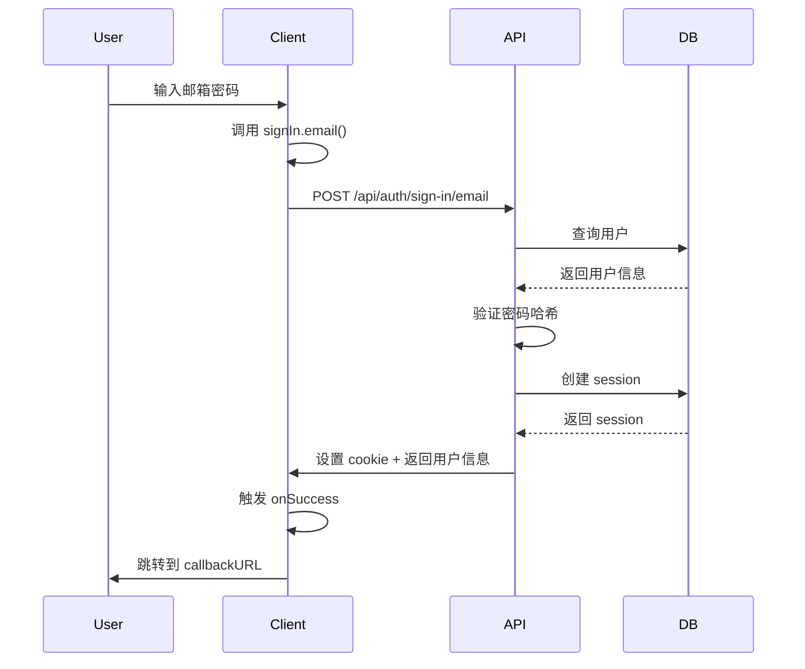
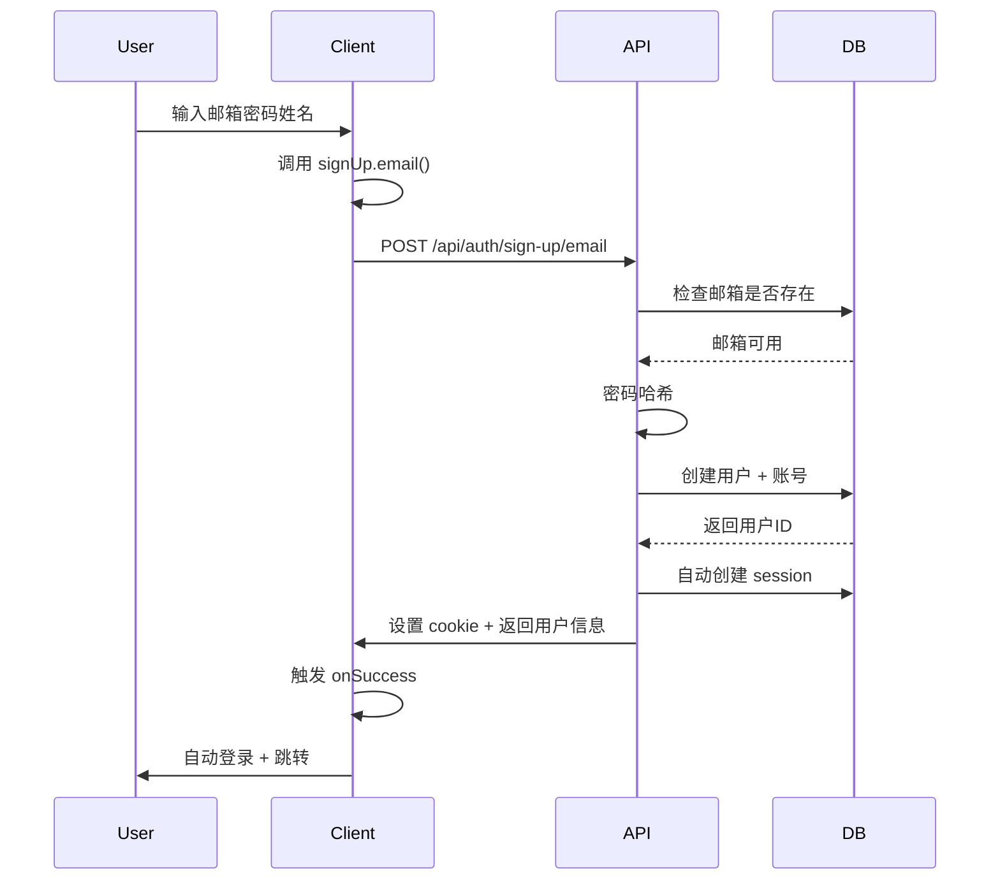
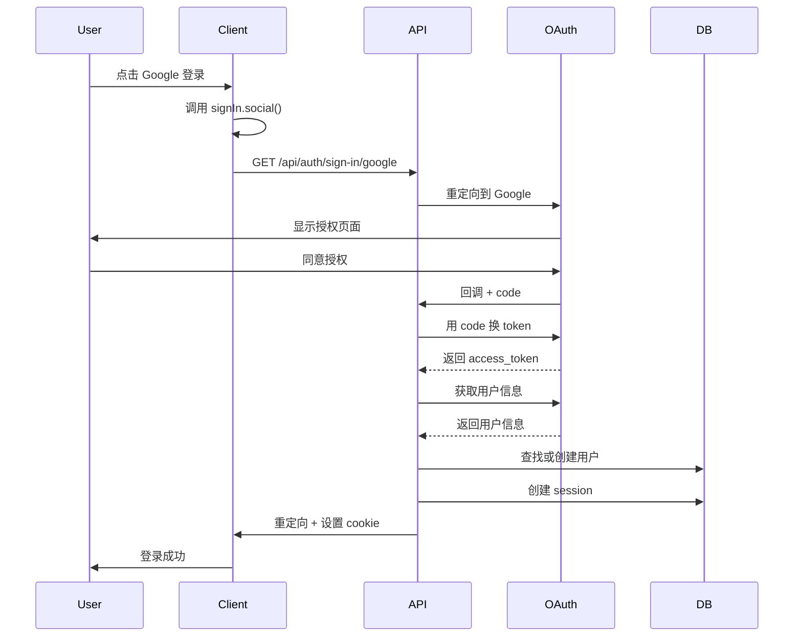

# Better Auth 方法详解

## 概述

`better-auth` 是一个 TypeScript 认证框架，提供了完整的认证功能。从 `createAuthClient()` 创建的客户端中导出的方法包括：

```typescript
export const { signIn, signUp, signOut, useSession } = authClient;
```

## 1. signIn - 登录方法

### 1.1 邮箱密码登录 (signIn.email)

**方法签名**:
```typescript
signIn.email(
  credentials: {
    email: string;
    password: string;
    callbackURL?: string;
  },
  options?: {
    onRequest?: (ctx: any) => void;
    onResponse?: (ctx: any) => void;
    onSuccess?: (ctx: any) => void;
    onError?: (error: any) => void;
  }
): Promise<void>
```

**实际使用示例**:
```typescript
// 文件: src/shared/blocks/sign/sign-in-form.tsx
const handleSignIn = async () => {
  await signIn.email(
    {
      email,           // 用户邮箱
      password,        // 用户密码
      callbackURL: callbackUrl,  // 登录成功后跳转的URL
    },
    {
      onRequest: (ctx) => {
        // 请求开始时的回调
        setLoading(true);
      },
      onResponse: (ctx) => {
        // 收到响应时的回调
        setLoading(false);
      },
      onSuccess: (ctx) => {
        // 登录成功的回调
        // 可以在这里处理成功后的逻辑
      },
      onError: (e: any) => {
        // 登录失败的回调
        toast.error(e?.error?.message || 'sign in failed');
        setLoading(false);
      },
    }
  );
};
```

**内部逻辑流程**:
1. 发送 POST 请求到 `/api/auth/sign-in/email`
2. 请求体包含 `{ email, password }`
3. 服务端验证凭据：
   - 查询数据库中的用户
   - 验证密码哈希
   - 检查账号状态
4. 验证成功后：
   - 创建 session 记录
   - 生成 session token
   - 设置 httpOnly cookie
   - 返回用户信息
5. 客户端自动处理：
   - 存储 session token
   - 触发 `onSuccess` 回调
   - 如果设置了 `callbackURL`，自动跳转

### 1.2 社交登录 (signIn.social)

**方法签名**:
```typescript
signIn.social(
  options: {
    provider: string;        // 'google' | 'github' | ...
    callbackURL?: string;
  },
  callbacks?: {
    onRequest?: (ctx: any) => void;
    onResponse?: (ctx: any) => void;
    onSuccess?: (ctx: any) => void;
    onError?: (error: any) => void;
  }
): Promise<void>
```

**实际使用示例**:
```typescript
// 文件: src/shared/blocks/sign/social-providers.tsx
const handleSignIn = async ({ provider }: { provider: string }) => {
  await signIn.social(
    {
      provider: provider,      // 'google' 或 'github'
      callbackURL: callbackUrl,
    },
    {
      onRequest: (ctx) => {
        setLoading(true);
      },
      onResponse: (ctx) => {
        setLoading(false);
        setIsShowSignModal(false);
      },
      onSuccess: (ctx) => {},
      onError: (e: any) => {
        toast.error(e?.error?.message || 'sign in failed');
        setLoading(false);
      },
    }
  );
};
```

**内部逻辑流程**:
1. 构建 OAuth 授权 URL
2. 重定向到第三方登录页面（Google/GitHub）
3. 用户在第三方页面授权
4. 回调到 `/api/auth/callback/{provider}`
5. 服务端处理：
   - 用 code 换取 access_token
   - 获取用户信息
   - 查找或创建用户账号
   - 创建 session
6. 重定向到 `callbackURL`

## 2. signUp - 注册方法

### 2.1 邮箱注册 (signUp.email)

**方法签名**:
```typescript
signUp.email(
  credentials: {
    email: string;
    password: string;
    name: string;
  },
  options?: {
    onRequest?: (ctx: any) => void;
    onResponse?: (ctx: any) => void;
    onSuccess?: (ctx: any) => void;
    onError?: (error: any) => void;
  }
): Promise<void>
```

**实际使用示例**:
```typescript
// 文件: src/shared/blocks/sign/sign-up.tsx
const handleSignUp = async () => {
  await signUp.email(
    {
      email,
      password,
      name,
    },
    {
      onRequest: (ctx) => {
        setLoading(true);
      },
      onResponse: (ctx) => {
        setLoading(false);
      },
      onSuccess: (ctx) => {
        // 注册成功后的处理
        reportAffiliate({ userEmail: email });
        router.push(callbackUrl);
      },
      onError: (e: any) => {
        toast.error(e?.error?.message || 'sign up failed');
        setLoading(false);
      },
    }
  );
};
```

**内部逻辑流程**:
1. 发送 POST 请求到 `/api/auth/sign-up/email`
2. 请求体包含 `{ email, password, name }`
3. 服务端处理：
   - 检查邮箱是否已存在
   - 密码哈希（bcrypt/argon2）
   - 创建用户记录到 `user` 表
   - 创建账号记录到 `account` 表
   - 自动创建 session（自动登录）
4. 返回用户信息和 session
5. 客户端触发 `onSuccess` 回调

**数据库操作**:
```sql
-- 插入用户
INSERT INTO user (id, email, name, email_verified, created_at, updated_at)
VALUES (uuid, email, name, false, now(), now());

-- 插入账号（存储密码哈希）
INSERT INTO account (id, user_id, provider_id, account_id, password)
VALUES (uuid, user_id, 'credential', email, hashed_password);

-- 创建会话
INSERT INTO session (id, user_id, token, expires_at, created_at)
VALUES (uuid, user_id, token, expires_at, now());
```

## 3. signOut - 登出方法

**方法签名**:
```typescript
signOut(
  options?: {
    fetchOptions?: {
      onSuccess?: () => void;
      onError?: (error: any) => void;
    };
  }
): Promise<void>
```

**实际使用示例**:
```typescript
// 文件: src/shared/blocks/sign/sign-user.tsx
signOut({
  fetchOptions: {
    onSuccess: () => {
      router.push('/');
    },
  },
})
```

**内部逻辑流程**:
1. 发送 POST 请求到 `/api/auth/sign-out`
2. 服务端处理：
   - 从 cookie 中获取 session token
   - 删除数据库中的 session 记录
   - 清除 session cookie
3. 客户端：
   - 清除本地 session 状态
   - 触发 `onSuccess` 回调
   - 通常跳转到首页或登录页

**数据库操作**:
```sql
-- 删除会话
DELETE FROM session WHERE token = ? AND user_id = ?;
```

## 4. useSession - 会话 Hook

**方法签名**:
```typescript
useSession(): {
  data: Session | null;
  isPending: boolean;
  error: Error | null;
}
```

**实际使用示例**:
```typescript
// 文件: src/shared/contexts/app.tsx
const { data: session, isPending } = useSession();

useEffect(() => {
  if (session && session.user) {
    setUser(session.user as User);
    fetchUserInfo();
  } else {
    setUser(null);
  }
}, [session]);
```

**内部逻辑**:
1. 自动从 cookie 中读取 session token
2. 发送请求到 `/api/auth/session` 验证 token
3. 返回当前用户信息和 session 状态
4. 自动处理 session 刷新
5. 监听 session 变化并更新状态

**返回数据结构**:
```typescript
{
  data: {
    session: {
      id: string;
      userId: string;
      expiresAt: Date;
    };
    user: {
      id: string;
      email: string;
      name: string;
      image?: string;
      emailVerified: boolean;
    };
  } | null;
  isPending: boolean;  // 加载中
  error: Error | null; // 错误信息
}
```

## 完整认证流程图

### 邮箱登录流程


### 注册流程


### 社交登录流程


## 服务端 API 端点

Better Auth 自动创建以下端点（通过 `/api/auth/[...all]/route.ts`）：

```typescript
// 文件: src/app/api/auth/[...all]/route.ts
import { toNextJsHandler } from 'better-auth/next-js';
import { getAuth } from '@/core/auth';

export async function POST(request: Request) {
  const auth = await getAuth();
  const handler = toNextJsHandler(auth.handler);
  return handler.POST(request);
}

export async function GET(request: Request) {
  const auth = await getAuth();
  const handler = toNextJsHandler(auth.handler);
  return handler.GET(request);
}
```

**自动生成的端点**:
- `POST /api/auth/sign-in/email` - 邮箱登录
- `POST /api/auth/sign-up/email` - 邮箱注册
- `GET /api/auth/sign-in/google` - Google 登录
- `GET /api/auth/sign-in/github` - GitHub 登录
- `GET /api/auth/callback/google` - Google 回调
- `GET /api/auth/callback/github` - GitHub 回调
- `POST /api/auth/sign-out` - 登出
- `GET /api/auth/session` - 获取会话
- `POST /api/auth/session/refresh` - 刷新会话

## 配置文件

### 服务端配置
```typescript
// 文件: src/core/auth/config.ts
export async function getAuthOptions() {
  const configs = await getAllConfigs();
  return {
    baseURL: envConfigs.auth_url,
    secret: envConfigs.auth_secret,
    database: drizzleAdapter(db(), {
      provider: 'pg',
      schema: schema,
    }),
    emailAndPassword: {
      enabled: configs.email_auth_enabled !== 'false',
    },
    socialProviders: {
      google: {
        clientId: configs.google_client_id,
        clientSecret: configs.google_client_secret,
      },
      github: {
        clientId: configs.github_client_id,
        clientSecret: configs.github_client_secret,
      },
    },
  };
}
```

### 客户端配置
```typescript
// 文件: src/core/auth/client.ts
export const authClient = createAuthClient({
  baseURL: envConfigs.auth_url,
  secret: envConfigs.auth_secret,
});
```

## 安全特性

1. **密码哈希**: 使用 bcrypt/argon2 哈希密码
2. **Session Token**: 随机生成的安全 token
3. **HttpOnly Cookie**: 防止 XSS 攻击
4. **Secure Cookie**: 生产环境强制 HTTPS
5. **CSRF 保护**: SameSite cookie 属性
6. **Session 过期**: 自动过期和刷新机制
7. **OAuth State**: 防止 CSRF 的 state 参数

## 错误处理

所有方法都支持错误处理：

```typescript
try {
  await signIn.email({ email, password });
} catch (error) {
  // 处理错误
  if (error.error?.code === 'INVALID_CREDENTIALS') {
    toast.error('邮箱或密码错误');
  } else if (error.error?.code === 'USER_NOT_FOUND') {
    toast.error('用户不存在');
  } else {
    toast.error('登录失败');
  }
}
```

## 常见错误码

- `INVALID_CREDENTIALS`: 凭据无效（密码错误）
- `USER_NOT_FOUND`: 用户不存在
- `EMAIL_ALREADY_EXISTS`: 邮箱已被注册
- `INVALID_EMAIL`: 邮箱格式无效
- `WEAK_PASSWORD`: 密码强度不够
- `SESSION_EXPIRED`: 会话已过期
- `UNAUTHORIZED`: 未授权

## 最佳实践

1. **始终使用 try-catch** 包裹认证调用
2. **提供友好的错误提示** 给用户
3. **使用 loading 状态** 防止重复提交
4. **登录后跳转** 使用 `callbackURL`
5. **注册后自动登录** better-auth 默认行为
6. **监听 session 变化** 使用 `useSession` hook
7. **登出后清理状态** 清除本地缓存和状态

## 总结

Better Auth 提供的这些方法封装了完整的认证逻辑：

- **signIn**: 处理登录（邮箱/社交）
- **signUp**: 处理注册
- **signOut**: 处理登出
- **useSession**: 管理会话状态

所有方法都是异步的，支持回调函数，自动处理 cookie 和 session，提供了完整的类型支持。
