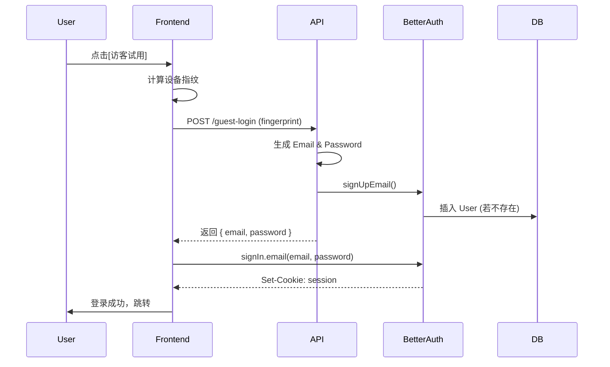

# 访客登录逻辑总结 (Guest Login Logic Summary)

## 1. 概述
本工程实现了基于设备指纹的访客登录功能。该功能允许用户在无需手动注册的情况下，通过浏览器设备指纹自动生成临时账号进行试用。系统复用了现有的 `better-auth` 认证体系，将访客视为一种特殊的普通用户。

## 2. 核心流程

### 2.1 总体架构
*   **设备识别**: 使用 `@fingerprintjs/fingerprintjs` 在前端生成唯一的设备指纹。
*   **账号生成**: 后端根据指纹生成确定性的 Email 和 Password。
*   **认证集成**: 复用 `better-auth` 的邮箱注册 (`signUpEmail`) 和登录 (`signIn.email`) 流程。
*   **数据存储**: 访客数据直接存储在 `user` 表中，不使用独立的访客表。

### 2.2 详细步骤

1.  **前端发起 (Client)**:
    *   用户点击"访客试用"。
    *   前端调用 `generateFingerprint()` 获取设备指纹。
    *   将指纹发送给后端接口 `/api/auth/guest-login`。

2.  **后端处理 (Server)**:
    *   接口 `/api/auth/guest-login` 接收指纹。
    *   **生成凭据**:
        *   `guestId`: 指纹的 SHA256 哈希前 16 位。
        *   `email`: `guest_{guestId}@temp.local`。
        *   `password`: 基于 `guestId` 和密钥生成的确定性哈希的前 8 位。
    *   **自动注册**:
        *   调用 `better-auth` 的 `api.signUpEmail` 尝试注册该邮箱。
        *   如果用户已存在（指纹对应的账号已创建），捕获错误并忽略。
    *   **返回凭据**: 将生成的 `email` 和 `password` 返回给前端。

3.  **前端登录 (Client)**:
    *   前端接收到 `email` 和 `password`。
    *   调用 `better-auth` 客户端的 `signIn.email({ email, password })`。
    *   登录成功，跳转至回调页面。

## 3. 关键文件与代码逻辑

### 3.1 工具类 `src/shared/models/guest-user.ts`
负责访客相关的计算逻辑，无数据库依赖。
*   `generateGuestId(fingerprint)`: 指纹 -> GuestID。
*   `generateGuestEmail(guestId)`: GuestID -> `guest_xxx@temp.local`。
*   `generateGuestPassword(guestId)`: GuestID -> 8位确定性密码。
*   `isGuestEmail(email)`: 判断是否为访客账号。

### 3.2 后端接口 `src/app/api/auth/guest-login/route.ts`
核心业务接口。
*   验证指纹参数。
*   调用工具类生成凭据。
*   执行 `auth.api.signUpEmail` 确保用户存在。
*   返回 `{ email, password }`。

### 3.3 前端组件 `src/shared/blocks/sign/sign-in-form.tsx`
UI 与交互逻辑。
*   `handleGuestLogin`: 主逻辑函数。
    1.  获取指纹。
    2.  请求后端 API。
    3.  执行登录。
    4.  错误处理与 Toast 提示。
*   *(注: 代码中保留了 `handleGuestLogin2` 作为纯前端生成的备选方案，但目前未启用)*

## 4. 数据模型

访客用户在数据库中表现为标准的 `user` 记录：

| 字段 | 值示例 | 说明 |
| :--- | :--- | :--- |
| `name` | `Guest_a1b2c3` | 自动生成的显示名 |
| `email` | `guest_a1b2c3...@temp.local` | 唯一标识，用于登录 |
| `emailVerified` | `false` | 访客邮箱默认为未验证 |
| `image` | (空) | |

## 5. 访客转正

由于访客就是普通用户，转正逻辑非常简单：
1.  用户登录后进入"个人设置" (Profile)。
2.  修改 Email 为真实的个人邮箱。
3.  完成邮箱验证。
4.  账号即从"访客"状态转变为"正式"状态，原有数据（聊天记录等）完全保留。

## 6. 待优化/注意项

*   **访客状态接口**: 代码中存在 `src/app/api/auth/guest-status/route.ts`，但其引用的 `findGuestByGuestId` 方法已在工具类中移除。如需使用此接口，需更新逻辑以查询 `user` 表或直接使用 `better-auth` 的 session 检查。
*   **安全性**: 密码由指纹确定性生成。这意味着只要拥有设备指纹，即可生成密码登录。这对于"访客试用"场景是可接受的，但在高安全需求场景下需注意。
*   **数据清理**: 目前未实现自动清理过期访客的逻辑。访客数据会长期保留在 `user` 表中。

## 7. 流程图示

