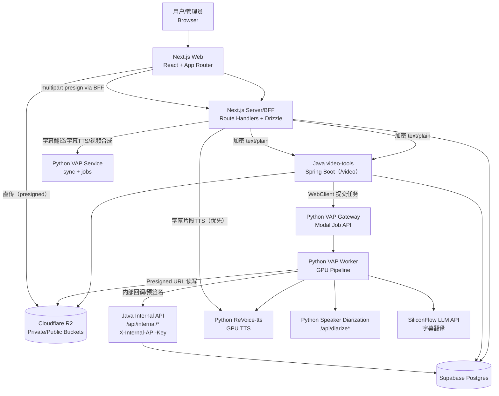
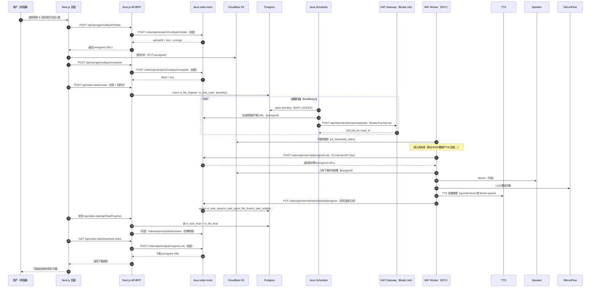
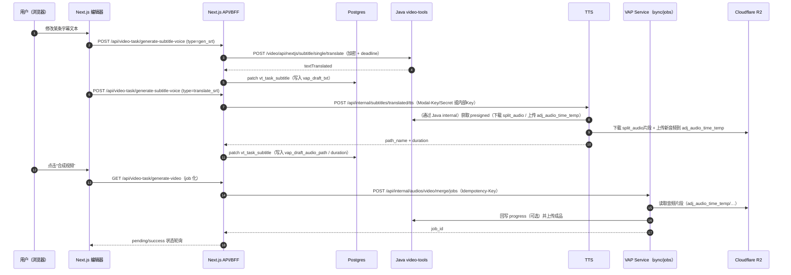

# 总体系统架构（整合版）

本系统目标：把“用户上传的视频”自动处理为“目标语言配音后的新视频”，并提供字幕编辑、单段重生成、成品下载等能力。

本文只讲 **系统级结构与调用链**；每个子系统的详细拆解见同目录其它文档。

## 🎯 两种运行形态（必须先分清）

系统在代码层同时支持两类部署/运行方式，调用链略有差异：

1. **Modal Job 形态（推荐/生产常用）**
   - Java 调度端通过 `POST /api/internal/video/translate/jobs` 提交任务（短请求，返回 202）
   - Python 侧由 Modal 管理 job/worker 生命周期，支持冷启动、取消、并发门禁
2. **RunPod / 本地 FastAPI 形态（调试常用）**
   - Python 直接以 `uvicorn` 暴露 FastAPI 路由（端口 9002/9003/9006 等）
   - 长任务通常以 SSE 或同步接口暴露（更依赖上游超时/反向代理配置）

后续图示会同时标注两者的差异点。

## 🧩 组件关系图（容器级）

**关键点**：

- Next.js **既是前端 UI**，也是 **BFF/Server**：它直接读写 DB（Drizzle），并代理调用 Java/Python。
- Java 是 **控制面 + 调度面**：统一生成 R2 预签名、调度 pending 任务、接收 Python 回调并落库（steps/logs/finals/subtitles）。
- Python VAP 是 **数据面编排**：下载原视频、跑整条处理流水线，并通过 Java 内部接口拿预签名 + 回写进度。
- TTS / Speaker 是 VAP 的 **内部依赖**（VAP 调用它们，不建议 Java/前端直连，除“字幕片段重生成”这种编辑场景例外）。

## 🔁 端到端时序（核心链路）

### A) 用户上传并创建任务 → Java 调度 → Python 执行 → 结果就绪

**这条链路的“真相源”**：

- 任务状态/进度：DB `vt_task_main` + `vt_task_steps`
- 成品可下载清单：DB `vt_file_final`（由 Java 在“步骤 completed”时 upsert，避免前端探测 R2）
- 文件实体：R2（私桶/公桶），由 Java 统一签名，Python 用 presigned 读写

### B) 字幕编辑闭环（单段重生成 → 合成新视频）

> 典型场景：用户在字幕编辑器修改某一条字幕文字，希望只重做该片段音频并合成新视频。

## 📌 系统边界与职责分工（避免“重复造轮子/互相覆盖”）

- Next.js（BFF）负责：
  - 用户交互与权限校验（better-auth + RBAC）
  - 直接读写业务表（任务/字幕草稿/积分等）
  - 对浏览器提供稳定 API（避免暴露 Java/Python 的复杂鉴权）
- Java（video-tools）负责：
  - R2 控制面（预签名、multipart、bucket 策略、文件移动/覆盖）
  - 任务调度（claim + backoff + 提交 Python）
  - Python 内部回调落库（steps/log/subtitles/finals），并保证 DB 作为真相源
- Python（VAP/TTS/Speaker）负责：
  - GPU/音视频/ASR/TTS 等重计算
  - 通过 Java internal 获取 presigned URL（不直接持有 R2 永久凭证）
  - 通过 Java internal 回写进度与最终文件清单（间接落库）

## 🗂️ 关键仓库位置（代码基准）

- 前端：`/Users/dashuai/webProjects/ReVoice-web-shipany-two`
- Java：`/Users/dashuai/IdeaProjects/video-tools`
- Python VAP：`/Users/dashuai/PycharmProjects/ReVoice-v-a-processing`
- Python TTS：`/Users/dashuai/PycharmProjects/ReVoice-tts`
- Python Speaker：`/Users/dashuai/PycharmProjects/ReVoice-speaker-reg`

