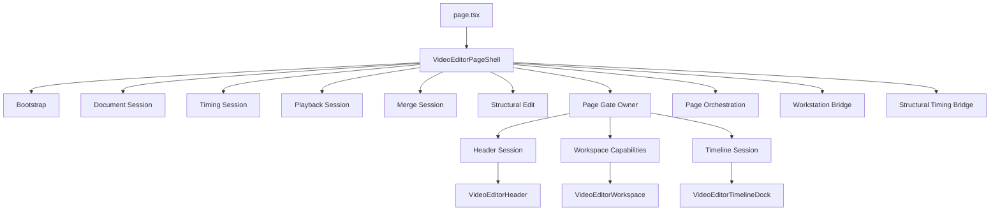
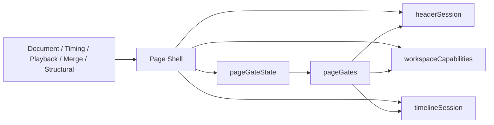
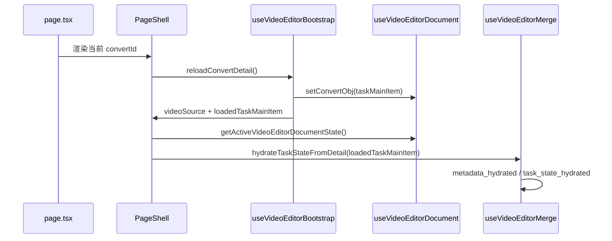
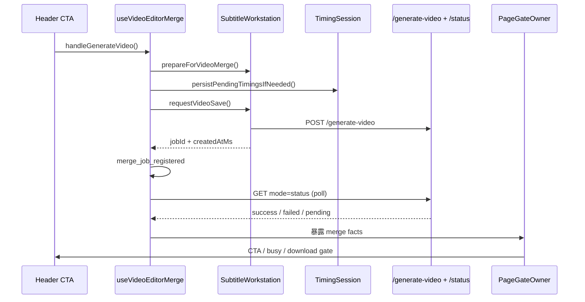

# 视频编辑页当前完整逻辑与改造成果审查文档

> 日期：2026-04-02
> 目标：基于当前代码真实实现，完整说明视频编辑页的业务闭环、状态 owner、页面门控和本轮模块化改造结果，供后续审查使用。

## 一、文档定位

这不是新的设计稿，而是对**当前已落地实现**的审查文档。

重点回答 4 个问题：

1. 当前视频编辑页到底由哪些 owner 组成
2. 每条用户路径的完整闭环是什么
3. 这轮模块化改造到底把什么收口了
4. 现在还剩哪些边界需要继续关注，但不应该盲目再拆

当前主入口文件：

- [page.tsx](/Users/dashuai/webProjects/ReVoice-web-shipany-two/src/app/[locale]/(dashboard)/video_convert/video-editor/[id]/page.tsx)
- [video-editor-page-shell.tsx](/Users/dashuai/webProjects/ReVoice-web-shipany-two/src/app/[locale]/(dashboard)/video_convert/video-editor/[id]/video-editor-page-shell.tsx)

本轮关键设计与落地参考：

- [2026-03-30-video-editor-page-modularization-design.md](/Users/dashuai/webProjects/ReVoice-web-shipany-two/docs/superpowers/specs/2026-03-30-video-editor-page-modularization-design.md)
- [2026-04-02-video-editor-merge-gate-owner-design.md](/Users/dashuai/webProjects/ReVoice-web-shipany-two/docs/superpowers/specs/2026-04-02-video-editor-merge-gate-owner-design.md)

## 二、当前总体架构

### 2.1 页面分层

当前编辑页已经不是“一个巨型 page 文件直接 owner 全部逻辑”，而是这几层：



### 2.2 当前 shell 的真实职责

[video-editor-page-shell.tsx](/Users/dashuai/webProjects/ReVoice-web-shipany-two/src/app/[locale]/(dashboard)/video_convert/video-editor/[id]/video-editor-page-shell.tsx) 现在的角色是**薄壳装配层**，主要做 5 件事：

1. 初始化各个 session owner
2. 通过 bridge 串起工作台与 merge/structural 的前置条件
3. 把各 owner 的原始状态压成 page gate
4. 生成 `headerSession / workspaceCapabilities / timelineSession`
5. 渲染 Header、Workspace、Timeline、UnsavedDialog

它不再直接维护这些高风险状态事实源：

- merge phase
- merge job 轮询 owner
- 页面主按钮门控
- 下载门控
- 结构编辑 capability
- playback transport 细节

## 三、当前单一事实源与 Owner 分布

### 3.1 Bootstrap Owner

文件：

- [use-video-editor-bootstrap.ts](/Users/dashuai/webProjects/ReVoice-web-shipany-two/src/app/[locale]/(dashboard)/video_convert/video-editor/[id]/runtime/bootstrap/use-video-editor-bootstrap.ts)

职责：

- 拉取任务详情
- 管理 blocking/background reload
- 把 `taskMainItem` 回写到 document owner
- 给页面提供 `videoSource` 和 `loadedTaskMainItem`

特点：

- 只 owner“详情加载会话”
- 不 owner 编辑状态本身
- 用 `requestId + convertId + abort` 防止旧请求污染新页面

### 3.2 Document Owner

文件：

- [use-video-editor-document.ts](/Users/dashuai/webProjects/ReVoice-web-shipany-two/src/app/[locale]/(dashboard)/video_convert/video-editor/[id]/runtime/document/use-video-editor-document.ts)
- [video-editor-document-reducer.ts](/Users/dashuai/webProjects/ReVoice-web-shipany-two/src/app/[locale]/(dashboard)/video_convert/video-editor/[id]/runtime/document/video-editor-document-reducer.ts)
- [video-editor-document-selectors.ts](/Users/dashuai/webProjects/ReVoice-web-shipany-two/src/app/[locale]/(dashboard)/video_convert/video-editor/[id]/runtime/document/video-editor-document-selectors.ts)
- [video-editor-document-mappers.ts](/Users/dashuai/webProjects/ReVoice-web-shipany-two/src/app/[locale]/(dashboard)/video_convert/video-editor/[id]/runtime/document/video-editor-document-mappers.ts)

它是页面级**文档事实源**，统一 owner：

- `convertObj`
- `videoTrack`
- `bgmTrack`
- `subtitleTrack`
- `subtitleTrackOriginal`
- `pendingVoiceEntries`
- `playbackBlockedVoiceIds`
- `pendingTimingMap`
- `serverLastMergedAtMs`
- `workstationDirty`

派生出来的页面级 pending 结论也统一来自它：

- `pendingMergeIdSet`
- `pendingMergeCount`
- `pendingMergeVoiceCount`
- `pendingMergeTimingCount`
- `explicitMissingVoiceIdSet`
- `localPendingVoiceIdSet`
- `playbackBlockedVoiceIdSet`
- `hasUnsavedChanges`

### 3.3 Timing Owner

文件：

- [use-video-editor-timing-session.ts](/Users/dashuai/webProjects/ReVoice-web-shipany-two/src/app/[locale]/(dashboard)/video_convert/video-editor/[id]/runtime/timing/use-video-editor-timing-session.ts)
- [timing-session-owner.ts](/Users/dashuai/webProjects/ReVoice-web-shipany-two/src/app/[locale]/(dashboard)/video_convert/video-editor/[id]/runtime/timing/timing-session-owner.ts)
- [timing-persist-controller.ts](/Users/dashuai/webProjects/ReVoice-web-shipany-two/src/app/[locale]/(dashboard)/video_convert/video-editor/[id]/runtime/timing/timing-persist-controller.ts)

Timing owner 的边界很明确：

- **不**拥有完整文档
- **只**拥有 timing 持久化会话状态

它管理：

- autosave / manual persist / split persist / rollback reconcile
- `latestPersistIdMap`
- `lastPersistError`
- `lastPersistedAtMs`
- `phase`

而真正的 timing 数据事实源仍然在 document owner 的 `pendingTimingMap`。

### 3.4 Playback Owner

文件：

- [use-video-editor-playback.ts](/Users/dashuai/webProjects/ReVoice-web-shipany-two/src/app/[locale]/(dashboard)/video_convert/video-editor/[id]/runtime/playback/use-video-editor-playback.ts)
- [playback-session-owner.ts](/Users/dashuai/webProjects/ReVoice-web-shipany-two/src/app/[locale]/(dashboard)/video_convert/video-editor/[id]/runtime/playback/playback-session-owner.ts)
- [playback-transport-owner.ts](/Users/dashuai/webProjects/ReVoice-web-shipany-two/src/app/[locale]/(dashboard)/video_convert/video-editor/[id]/runtime/playback/playback-transport-owner.ts)
- [playback-video-sync.ts](/Users/dashuai/webProjects/ReVoice-web-shipany-two/src/app/[locale]/(dashboard)/video_convert/video-editor/[id]/runtime/playback/playback-video-sync.ts)
- [subtitle-audio-engine.ts](/Users/dashuai/webProjects/ReVoice-web-shipany-two/src/app/[locale]/(dashboard)/video_convert/video-editor/[id]/runtime/playback/subtitle-audio-engine.ts)
- [playback-blocking-owner.ts](/Users/dashuai/webProjects/ReVoice-web-shipany-two/src/app/[locale]/(dashboard)/video_convert/video-editor/[id]/runtime/playback/playback-blocking-owner.ts)
- [playback-blocking-retry-controller.ts](/Users/dashuai/webProjects/ReVoice-web-shipany-two/src/app/[locale]/(dashboard)/video_convert/video-editor/[id]/runtime/playback/playback-blocking-retry-controller.ts)
- [playback-audition-flow.ts](/Users/dashuai/webProjects/ReVoice-web-shipany-two/src/app/[locale]/(dashboard)/video_convert/video-editor/[id]/runtime/playback/playback-audition-flow.ts)
- [playback-audition-runtime.ts](/Users/dashuai/webProjects/ReVoice-web-shipany-two/src/app/[locale]/(dashboard)/video_convert/video-editor/[id]/runtime/playback/playback-audition-runtime.ts)
- [playback-time-loop.ts](/Users/dashuai/webProjects/ReVoice-web-shipany-two/src/app/[locale]/(dashboard)/video_convert/video-editor/[id]/runtime/playback/playback-time-loop.ts)

Playback 现在不是一个混乱的大 hook，而是分层了：

- `transport owner`
- `video sync`
- `subtitle audio engine`
- `blocking/retry controller`
- `audition flow`
- `seek owner`
- `control owner`
- `session owner`

播放的单一 transport 事实源来自 `editor-transport` reducer，而不是散落在多个布尔变量里。

### 3.5 Merge Owner

文件：

- [use-video-editor-merge.ts](/Users/dashuai/webProjects/ReVoice-web-shipany-two/src/app/[locale]/(dashboard)/video_convert/video-editor/[id]/runtime/merge/use-video-editor-merge.ts)
- [merge-session-owner.ts](/Users/dashuai/webProjects/ReVoice-web-shipany-two/src/app/[locale]/(dashboard)/video_convert/video-editor/[id]/runtime/merge/merge-session-owner.ts)
- [video-editor-merge-session.ts](/Users/dashuai/webProjects/ReVoice-web-shipany-two/src/app/[locale]/(dashboard)/video_convert/video-editor/[id]/runtime/merge/video-editor-merge-session.ts)

Merge owner 现在有两层：

1. `merge session reducer`
2. `merge runtime hook`

`merge session reducer` owner 的是 merge 领域事实：

- `phase`
- `taskStatus`
- `taskErrorMessage`
- `taskProgress`
- `taskCurrentStep`
- `activeJob`
- `failureCount`
- `lastMergedAtMs`

`useVideoEditorMerge` owner 的是 merge runtime 副作用：

- metadata hydrate
- task detail hydrate
- merge 状态轮询
- task progress 轮询
- generate / retry / download handlers

### 3.6 Structural Owner

文件：

- [use-video-editor-structural-edit.ts](/Users/dashuai/webProjects/ReVoice-web-shipany-two/src/app/[locale]/(dashboard)/video_convert/video-editor/[id]/runtime/structural/use-video-editor-structural-edit.ts)
- [video-editor-structural-edit.ts](/Users/dashuai/webProjects/ReVoice-web-shipany-two/src/app/[locale]/(dashboard)/video_convert/video-editor/[id]/video-editor-structural-edit.ts)

Structural owner 当前负责：

- split subtitle
- rollback latest
- undo countdown
- operation history
- structural block reason

并通过纯规则层统一判断：

- 当前是否允许 split
- 当前是否允许 rollback
- 阻塞原因是否是 `video-updating`

### 3.7 Page Gate Owner

文件：

- [video-editor-page-gates.ts](/Users/dashuai/webProjects/ReVoice-web-shipany-two/src/app/[locale]/(dashboard)/video_convert/video-editor/[id]/runtime/orchestration/video-editor-page-gates.ts)

这是本轮最关键的收口点之一。

它现在 owner 的不是原始状态，而是**页面级决策结果**：

- Header 主按钮模式
- Header busy spinner
- Header 下载门控
- Structural split/undo capability

核心原则：

- page 不重新拥有 merge/document/playback/structural 的事实源
- page 只消费这些 owner 的稳定输出，统一得到 capability

### 3.8 Page Orchestration

文件：

- [use-video-editor-page-orchestration.ts](/Users/dashuai/webProjects/ReVoice-web-shipany-two/src/app/[locale]/(dashboard)/video_convert/video-editor/[id]/runtime/orchestration/use-video-editor-page-orchestration.ts)

职责只剩 3 类：

- unsaved changes guard
- 返回导航
- 文案与 tooltip 翻译

它不再承担复杂跨域门控计算。

## 四、页面最终渲染协议

当前 shell 的装配出口有 3 个：

1. `headerSession`
2. `workspaceCapabilities`
3. `timelineSession`

这意味着视图组件现在更多是“消费协议”，而不是自己重算复杂状态。



这一步的意义是：

- Header 不再自己理解 merge 内部细节
- Timeline 不再自己理解 structural 阻塞细节
- Workspace 不再自己持有页面级 playback/merge 状态真相

## 五、核心闭环链路

下面按“真实用户路径”说明当前完整逻辑。

### 5.1 页面加载与激活闭环



完整逻辑：

1. 路由只把 `params.id` 交给 `VideoEditorPageShell`
2. bootstrap 请求详情接口
3. 成功后把 `taskMainItem` 回写到 document owner
4. document owner 将 `convertObj` 映射为 `videoTrack / bgmTrack / subtitleTrack / subtitleTrackOriginal`
5. shell 通过 `getActiveVideoEditorDocumentState` 只暴露当前任务的 active 文档
6. merge owner 同时接收 `loadedTaskMainItem` 做 task 状态 hydrate
7. 若 metadata 中存在 active merge job，则 merge owner 自动恢复 merge session

这一闭环解决了两个问题：

- 刷新后能恢复任务状态
- 切换任务后旧任务异步结果不会污染新任务

### 5.2 文档编辑与 timing 持久化闭环

完整逻辑：

1. 工作台或预览区修改字幕文本/音频/timing
2. 变更立即回到 document owner
3. document owner 重新派生 `documentPendingState`
4. timing 变化写入 `pendingTimingMap`
5. timing session 对 `pendingTimingMap` 启动 3 秒 autosave debounce
6. 若用户在 merge/split 前触发强制持久化，则走 `persistPendingTimingsIfNeeded`
7. 保存成功后：
   - 回写 `convertObj.srt_convert_arr`
   - 清掉已持久化 pending timing
   - 记录最新 `idMap`
8. 后续 split 等依赖字幕 id 的操作，先走 `remapSubtitleIdAfterTimingSave`

这个闭环保证：

- 本地 timing 先可见、后落库
- timing 保存后 id 漂移不会打断后续 split
- rollback 后能重新对账本地 pending timing

### 5.3 工作台字幕编辑 / 重翻译 / 重生成配音闭环

文件：

- [subtitle-workstation.tsx](/Users/dashuai/webProjects/ReVoice-web-shipany-two/src/app/[locale]/(dashboard)/video_convert/video-editor/[id]/subtitle-workstation.tsx)
- [subtitle-workstation-state.ts](/Users/dashuai/webProjects/ReVoice-web-shipany-two/src/app/[locale]/(dashboard)/video_convert/video-editor/[id]/subtitle-workstation-state.ts)

工作台不是页面真相 owner，但它是“字幕编辑工作流 owner”，内部负责：

- row 级本地文本编辑态
- draft audio 预览态
- source text autosave
- row 级 voice UI state
- resume pending jobs
- merge preflight / structural preflight

完整闭环：

1. 工作台加载 `sourceArr + convertArr`，构建 `subtitleItems`
2. 译文文本编辑后：
   - 立即回推 page 的 `onSubtitleTextChange`
   - 本地 draft autosave 异步落草稿
3. 原文文本编辑后：
   - 立即回推 page 的 `onSourceSubtitleTextChange`
   - 进入 source text autosave
4. 若重翻译成功：
   - 更新译文文本
   - 标记该行 `voiceStatus=missing`
   - 标记 `needsTts=true`
   - 通知 page owner 这行需要重新生成配音
5. 若重生成配音成功：
   - 行内保存 `draftAudioPath`
   - 更新 `audioUrl_convert_custom`
   - 通知 page `onUpdateSubtitleAudioUrl`
   - 通知 page `onSubtitleVoiceStatusChange(ready, false)`
   - 自动请求 convert audition
6. 若页面刷新：
   - 工作台会 resume pending jobs
   - 但所有异步结果都绑定 `activeTaskIdRef`

最关键的闭环约束：

- merge 前，工作台会 `prepareForVideoMerge`
- 若存在 `stale / text_ready / processing` 行，会阻断 merge
- 若存在 `audio_ready` 行，会先自动 apply/save，再允许 merge
- source-only 脏状态也必须先落库，否则 structural edit 不放行

### 5.4 正常播放闭环

完整逻辑：

1. 用户点击播放
2. `transport owner` 先检查当前是否处于 buffering / blocking / audition
3. 若当前 clip 不可播，直接进入 blocking state，而不是静默跳过
4. 若可播：
   - `video sync` 预热 video
   - `subtitle audio engine` 准备当前字幕音频
   - `transport` 切到 timeline playing
5. `time loop` 持续驱动：
   - currentTime
   - 自动滚动
   - clip 切换
   - webaudio/media 两套字幕播放同步
6. 正常结束后停止 transport，必要时自然进入下一段

当前保证：

- 不会因为单段音频未就绪就偷偷播原声
- 不会因为网络弱导致无限 silent retry
- 不会因为旧的 raf/timer 在任务切换后继续影响新页面

### 5.5 阻塞、重试、取消闭环

完整逻辑：

1. 不可播原因可能来自：
   - 配音缺失
   - 配音准备中
   - 网络失败
   - 媒体播放失败
2. 进入阻塞时统一走 `pausePlaybackForBlockingState`
3. 页面展示明确的 blocking 卡片/状态
4. 用户有 3 类动作：
   - retry
   - cancel
   - locate blocked clip
5. retry 由 `playback-blocking-retry-controller` 分流：
   - media backend 直接恢复 transport
   - webaudio backend 重新校验 gate，再决定继续阻塞还是恢复播放
6. cancel 会清理 buffering、停止音频、恢复 mute、回到 pause

这条链路的核心目标是：

- 用户遇到弱网或音频缺失时，不会被静默锁死
- 页面始终有明确的恢复出口

### 5.6 试听闭环

试听分两类：

- `source audition`
- `convert audition`

完整逻辑：

1. 用户请求试听某行
2. `playback-audition-flow` 先准备 audition token、恢复态快照、mute 编排
3. `source audition`：
   - 解析 segment / fallback 源音频
   - 准备完成后播放 source audio
4. `convert audition`：
   - 先校验 row 是否允许试听
   - 允许使用 `previewAudioUrl`
   - 这保证“刚生成成功但未合成”时也能试听
5. 试听结束：
   - 用户手动 stop，或自然结束
   - transport 退出 audition
   - 恢复试听前的 mute 状态
6. 若开启自动试听下一段，则 runtime 异步拉起下一段

这条链路是当前编辑页体验里非常重要的一点：

- 试听闭环与主时间轴播放闭环是分开的
- 这样才允许“先局部验证，再决定是否更新视频”

### 5.7 Split Subtitle 闭环

完整逻辑：

1. 用户在当前时间点触发 split
2. structural owner 先检查：
   - 页面是否正在 video updating
   - 当前时间点是否落在可分割 clip 内
   - 是否距离边界过近
3. 调工作台 `prepareForStructuralEdit`
4. 调 timing session `persistPendingTimingsIfNeeded`
5. 若播放中，先暂停
6. 用 `remapSubtitleIdAfterTimingSave` 取得最新 clipId
7. 请求 `/api/video-task/split-subtitle`
8. 成功后：
   - 更新 `convertObj.srt_convert_arr / srt_source_arr`
   - 清 voice cache
   - 清 active timeline clip
   - 滚动到新的左子片段
   - 标记 `hasUndoableOps`
   - toast 提醒“需要重新生成配音”

这条闭环保证：

- split 不会基于旧 id、旧 timing 错切
- split 后不会沿用旧的配音缓存

### 5.8 Rollback 闭环

完整逻辑：

1. 用户点击撤销
2. structural owner 开启 3 秒倒计时
3. 同时拉 operation history 找最近可 rollback 操作
4. 倒计时结束后执行 rollback
5. rollback 前再次做 structural preflight
6. 请求 `/api/video-task/rollback-operation`
7. 成功后：
   - 清 voice cache
   - 清 active timeline clip
   - 恢复 `translate/source`
   - timing session 对账本地 pending timing
   - 重新拉 operation history 更新 undo 能力

### 5.9 Generate Video / Merge / Download 闭环



完整逻辑：

1. Header 点击“更新视频”
2. merge hook 进入 `generate_started`
3. 调工作台 `prepareForVideoMerge`
4. 调 timing bridge `persistPendingTimingsIfNeeded`
5. 调工作台 `requestVideoSave`
6. 工作台请求后端生成视频，并通过 `onVideoMergeStarted` 把 `jobId + createdAtMs` 回推给页面
7. merge session 注册 active job，进入 `polling_status`
8. 页面开始 `mode=status` 轮询
9. 轮询返回：
   - `success`：完成、toast success、清 active job、刷新 mergedAt 基线
   - `failed`：失败、toast error、清 active job
   - 网络连续失败：进入 `manual_retry_required`
10. page gate owner 根据 merge facts 决定：
   - 主按钮是 `generate-video` 还是 `retry-status`
   - 是否显示 busy spinner
   - 下载入口是否可见/可点

这里是本轮改造最关键的闭环修正点。

## 六、本轮改造到底改了什么

### 6.1 总体方向

不是单纯拆文件，而是把**状态 owner、规则层、装配层**拆开。

### 6.2 已完成的关键改造

#### A. 页面主文件从超级 owner 改成装配壳层

当前 [video-editor-page-shell.tsx](/Users/dashuai/webProjects/ReVoice-web-shipany-two/src/app/[locale]/(dashboard)/video_convert/video-editor/[id]/video-editor-page-shell.tsx) 的主角色已经变成：

- 初始化 owner
- 做 bridge
- 产出 session / capability
- 渲染视图

而不是直接管理几千行业务逻辑。

#### B. Document / Timing / Playback / Structural 已形成独立 owner

这意味着：

- 文档编辑不再和播放细节绑死
- timing 保存不再散落在页面 effect 里
- structural edit 不再直接绑在 page 的全局局部状态上

#### C. Merge Session 已完成 owner 化

相比过去最大的变化是：

- merge phase 已显式化
- metadata 恢复、task hydrate、merge start、轮询失败、manual retry 都走同一个 owner
- 不再是散乱的 `useState + useEffect + ref` 临时拼装

#### D. Page Gate 已接管最核心的页面门控

本轮已经收口到 page gate owner 的核心决策：

- `mergePrimaryAction`
- `showBusySpinner`
- `headerDownloadState`

这三项之前最容易出现：

- 按钮状态和真实行为不一致
- 下载入口显示/隐藏和真实下载 guard 不一致
- merge 恢复态下页面门控漂移

### 6.3 改造后的责任边界

```text
Domain Owner
  -> 产出领域事实

Page Gate Owner
  -> 只消费事实，输出 capability

Page Shell
  -> 只装配 session/capability 到视图
```

这条边界是当前稳定性的核心。

## 七、当前用户体验保证

当前实现明确追求以下用户体验保证：

1. **不静默跳过不可播译音段**
   - 不会因为音频没准备好就偷偷跳下一段
   - 不会自动播原声来掩盖问题

2. **网络失败有明确出口**
   - 播放链路有 retry / cancel / locate
   - merge 轮询有 manual retry
   - download / save / split / rollback 都有超时

3. **试听和主播放闭环分离**
   - 刚生成成功但未合成时，用户仍可试听
   - 不必先 merge 才能验证单行结果

4. **任务切换与刷新恢复安全**
   - 异步结果都绑定 `activeTaskId` 或 request id
   - 旧任务不会污染新任务

5. **结构编辑不会和视频更新并发打架**
   - split / rollback 在 video updating 时统一阻塞
   - timing 未落库时先持久化，再执行结构操作

## 八、当前仍需关注的边界

以下不是当前必须继续大拆的点，但审查时应该明确知道：

### 8.1 下载 gate 仍有“双重使用”

当前下载门控是健康的，但仍有一个结构特征：

- page gate owner 负责页面下载 capability
- merge hook 内部仍复用 `getHeaderDownloadState` 做真实下载 handler guard

这不是错误，因为两边已经复用同一个 selector。  
但它是需要持续注意的边界：

- 以后如果修改下载规则，必须同时确保 UI capability 和 handler guard 仍来自同一逻辑

### 8.2 工作台仍然是一个较重的局部业务 owner

[subtitle-workstation.tsx](/Users/dashuai/webProjects/ReVoice-web-shipany-two/src/app/[locale]/(dashboard)/video_convert/video-editor/[id]/subtitle-workstation.tsx) 仍然较重，因为它本身就承担：

- row 级编辑态
- draft voice
- source autosave
- merge preflight
- structural preflight
- resume pending jobs

这不是当前最大的稳定性风险，但它仍是后续最值得继续收缩的局部区域。

### 8.3 Page shell 现在已经明显变薄，但仍是总装配点

它当前已经不再 owner 大量业务真相，但仍是：

- session 初始化入口
- bridge 汇合点
- capability 装配点

这意味着：

- 现在更应该优先做“复杂路径回归”
- 而不是继续在当下阶段盲目深拆 shell

## 九、审查结论

基于当前实现，视频编辑页已经形成了一个相对清晰的真实闭环：

1. `bootstrap` 拉详情
2. `document` 持有页面文档事实源
3. `timing` 持有 timing 持久化会话
4. `playback` 持有 transport / audition / blocking / retry
5. `merge` 持有视频生成与轮询恢复
6. `structural` 持有 split / rollback
7. `page gate` 统一产出页面 capability
8. `page shell` 只负责装配给 Header / Workspace / Timeline

这轮改造的核心价值，不是“代码拆成了更多文件”，而是：

- 单一事实源更明确
- 页面门控更集中
- 闭环失败出口更清晰
- 修一个点不再必然拖垮整个编辑页

如果后续继续审查，建议按这 4 个问题逐条看：

1. 某条链路的事实源到底在哪个 owner
2. 某个页面能力到底由哪个 gate 决策
3. 某个用户动作失败时是否有显式出口
4. 某个异步结果是否绑定当前任务 session

这 4 个问题都能答清楚，编辑页闭环基本就是健康的。
